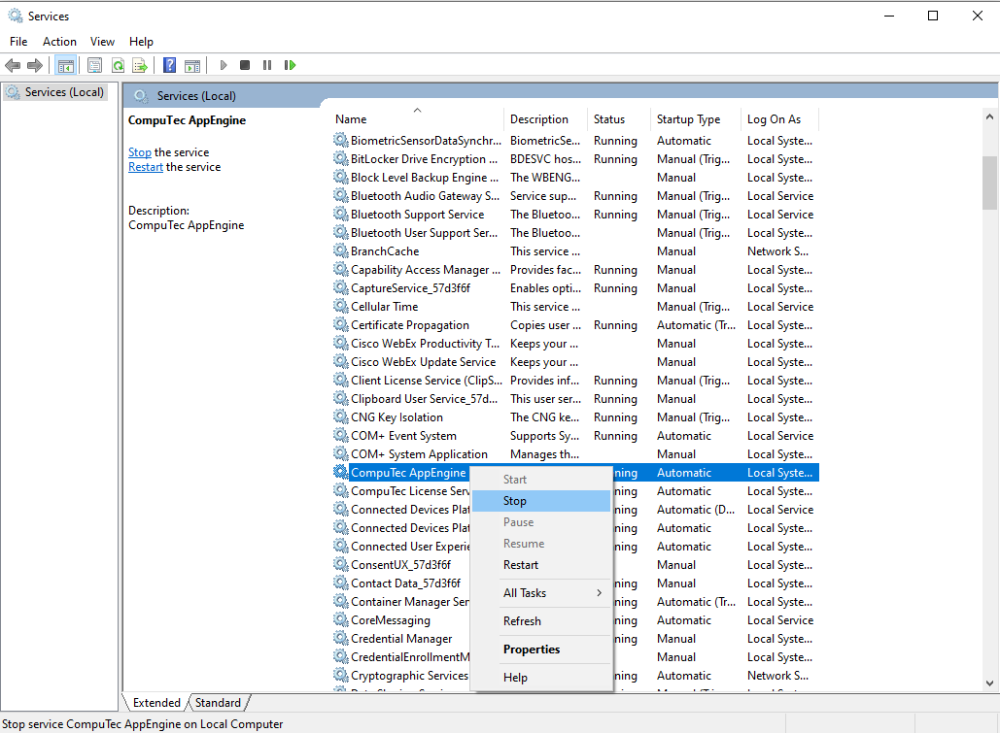
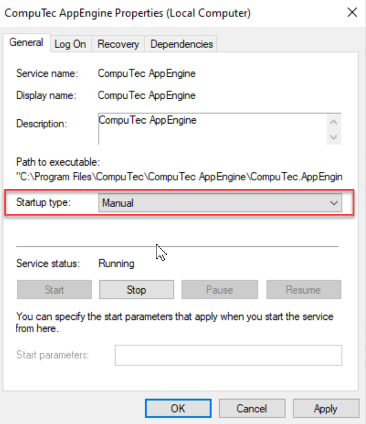
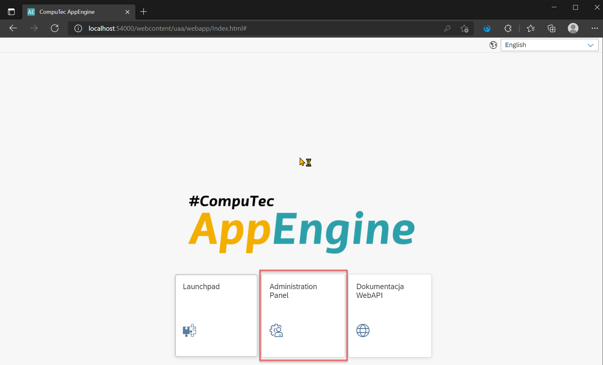
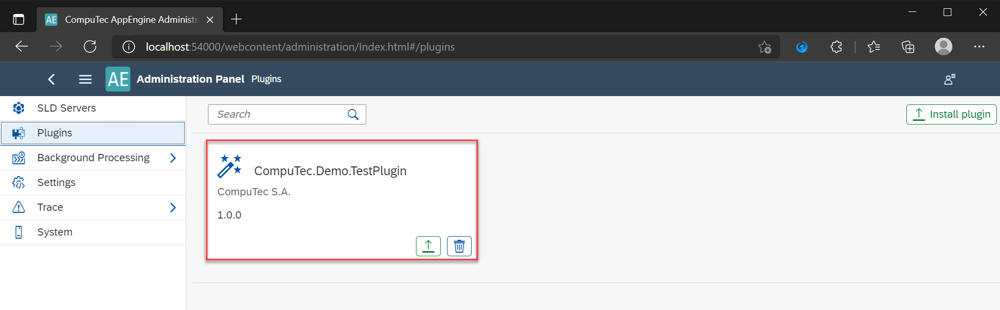
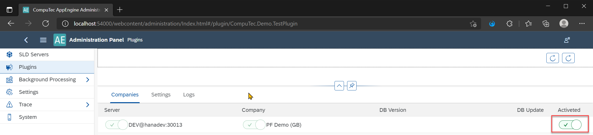
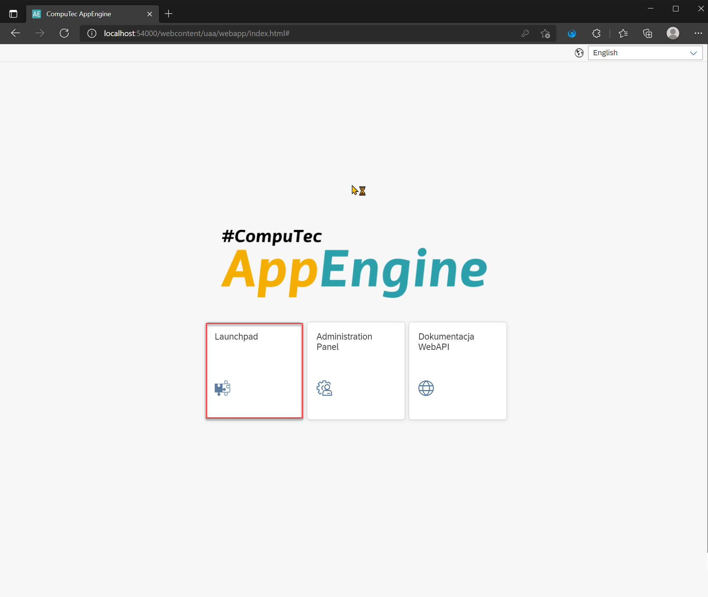
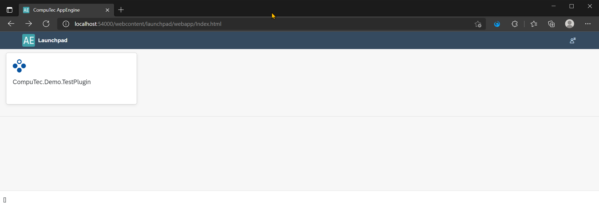
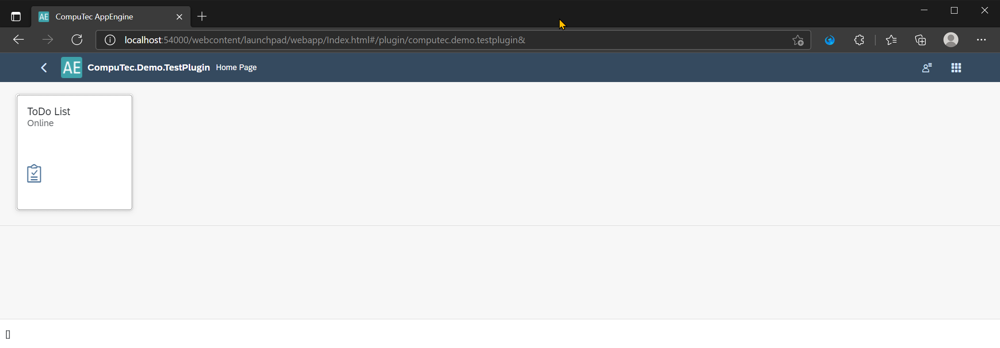
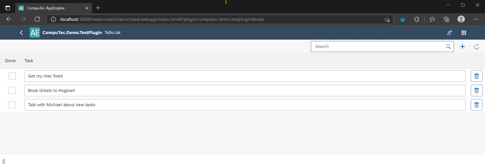

# SAPUI5 Plugin from Template step by step

## Create a new plugin project.

### Download

Go to the following address: https://www.nuget.org/packages?q=computec, and download CompuTec.AppEngine.Templates package.

### Adding

:::note
The following example will use a template for the AppEngine plugin with UI5 and Javascript on the front end.
:::

To install the package, go to Windows Terminal and run the following command:

```javascript
dotnet new --install CompuTec.AppEngine.Templates::2.0.0
```

You will get a message about successful installation and a list of installed elements. For now, five of them are ready plugin solution templates (tagged 'Add-In,'  'Add-In/Web/Javascript', you can also recognize them by the word 'plugin' in their names and short names), and seven plugin items (tagged "Visual C# Items'):


Once the package is installed, you can recheck the list using the following command:

```javascript
dotnet new --list AE
```

Create a new folder – named FirstPlugin in this example (mkdir FirstPlugin).

Go to the folder (cd .\FirstPlugin).

Use the following command to create a new template to work on it later (ctaepluginjs in this example). It has to be created along with two mandatory parameters: RoutePrefix (testPlugin in this example) and PluginID (Compu:Tec.AppEngine.Plugin.Test in this example:

```javascript
dotnet new ctaepluginjs --RoutePrefix testPlugin --PluginId CompuTec.AppEngine.Plugin.Test
```

## Visual Studio – Configure project build and debug

:::note
To run plugins without a plugin installation procedure, AppEngine needs to be in DevMode. The configuration of AppEngine is described in the next steps of this tutorial.
:::

1. To run your plugin, follow these steps:

    a. Open your Plugin Solution in Visual Studio.

    b. Open Properties for Plugin Project

    c. Open the Debug tab.

    d. As Start Action, select Start External Program and set up the path to CompuTec.AppEngine.Host.ConsoleApp.exe in the installation directory. In case of the default install, this file will be located in Program Files\CompuTec\CompuTec AppEngine\CompuTec.AppEngine.Host.ConsoleApp.exe

    

    e. Make sure that AppEngine service is stopped. You can check this in System Services. 

    

    f. To prevent this AppEngine from starting when Windows starts, go to properties and change the startup type to Manual or Disabled.

    

## Configure UI5 application file mapping

1. To make developers work more efficiently, AppEngine allows you to run it in Development Mode and to set up a path to frontend files in the Plugins project. Thanks to this, all changes made to frontend files are instantly visible without rebuilding the project. Below are described required steps to achieve this:

  a. Start CompuTec.AppEngine.Host.ConsoleApp.exe by debugging your plugin or from the command line. This first run will create separate configuration files for debug mode (in ProgramData\Computec\AppEngine):

    - dev_appengine.config

    - dev_backgroundProcessing.config

  b. Stop CompuTec.AppEngine.Host.ConsoleApp.exe

  c. To turn on the frontend debug mode, we need to edit the dev_appengine.config file.

  d. Set up:

    i. DevMode to True.

    ii. UIDevMode to True.

    iii. In DevUIMapping, specify the path to the source code of your UI5 Application files as the following key-value pair: \<PluginId\>:\<PluginPath\>. Frontend files from this path will be used instead of files from the AppEngine plugins directory.

  e. A path mapping example:

    ```javascript
    "DevMode": "True",
    "UIDevMode": "True",
    "DevUIMapping": {
		"CompuTec.Demo.TestPlugin": "C:/Users/maciejp/source/repos/CompuTec.Demo.TestPlugin/CompuTec.Demo.TestPlugin/www"
	},
    ```

  f. Start CompuTec.AppEngine.Host.ConsoleApp.exe, and you can verify your settings in the console.

  

## Results

1. After performing all these steps, your plugin should now be visible in the AppEngine Administration Panel.

2. Open a browser and navigate to http://localhost:54000/. Click on Administration Panel:



3. Login in. The default user name is CTSiteUser. The default Password is 12qw!@QW. You can change it in the configuration as described here.

4. Now select the Plugins tab.

  

5. Click on your plugin to open its configuration.

  

6. Activate Plugin on the selected database.

  

7. Open a new tab and navigate to http://localhost:54000/. Click on Launchpad:

  

8. Log in using the SAP username and password.

9. After successful authentication, all available plugins are visible. To open the plugin, click on its Tile. 

  

  

  
