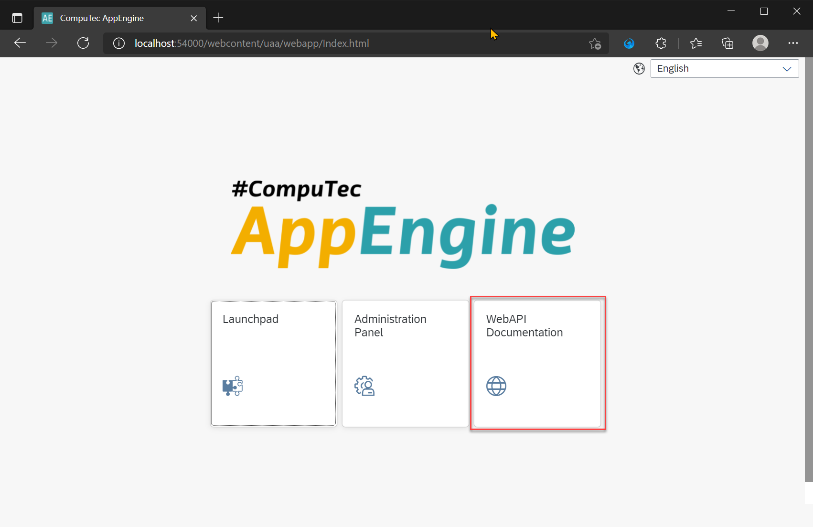
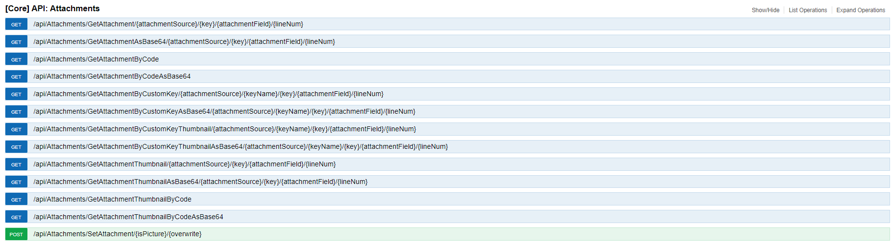
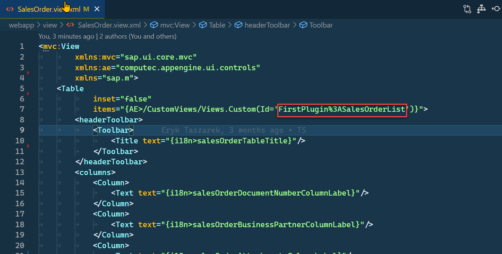

# Attachments

## Description

AppEngine comes with built-in, handy controllers for managing attachments in SAP Business One. If you open Documentation (swagger)...



...you can find description of the controllers. 



Below is an example of receiving and adding attachments from and to Sales Orders.

## Getting attachments from Sales Order

We will extend the Sales Orders list example that we have used so far. We will add a button that will display a dialog with attachments for particular Sales Order.

### Adding attachment information to Sales Orders list

1. Open SalesOrder.view.xml


2. Add new column Attachments.

```
<Column>
    <Text text="{i18n>salesOrderAttachmentsColumnLabel}"/>
</Column>
```

3. Add translation as described here.

```
<Message id="salesOrderAttachmentsColumnLabel" param="0">
    <translation lang="Default" Date="2011-08-09T15:55:59">Attachments</translation>
    <translation lang="ln_English" Date="2011-08-09T15:55:59">Attachments</translation>
    <translation lang="ln_Polish" Date="2011-08-09T15:55:59">Załączniki</translation>
</Message>
```

4. To make it a little bit more interesting, let's add the GenericTag control with ObjectNumber that will display number of attachments for each of orders.

    - First, we need to add information about attachments in our custom view that is used to list Sales Orders:



- Let's modify this custom view to add NumberOfAttachments to it. More details about Custom Views can be found here: here.

SalesOrderList.customview.json

