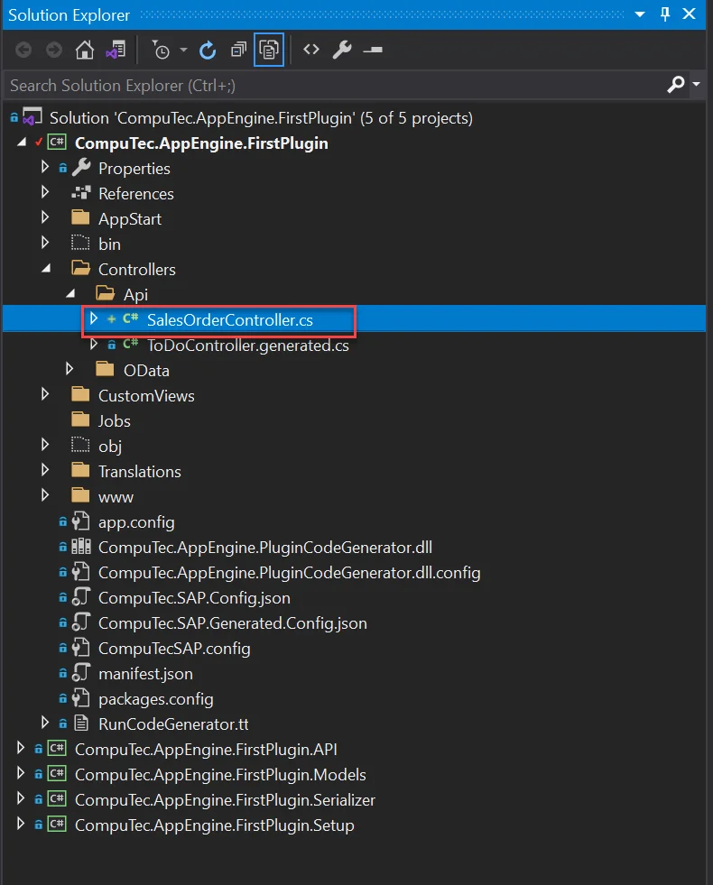
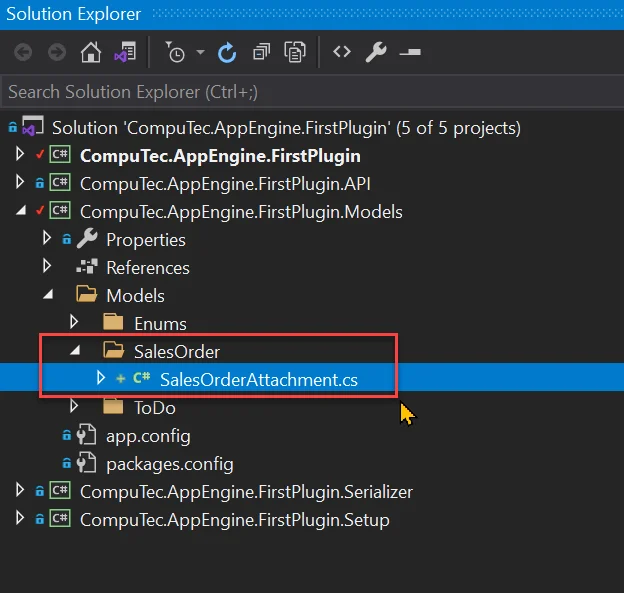
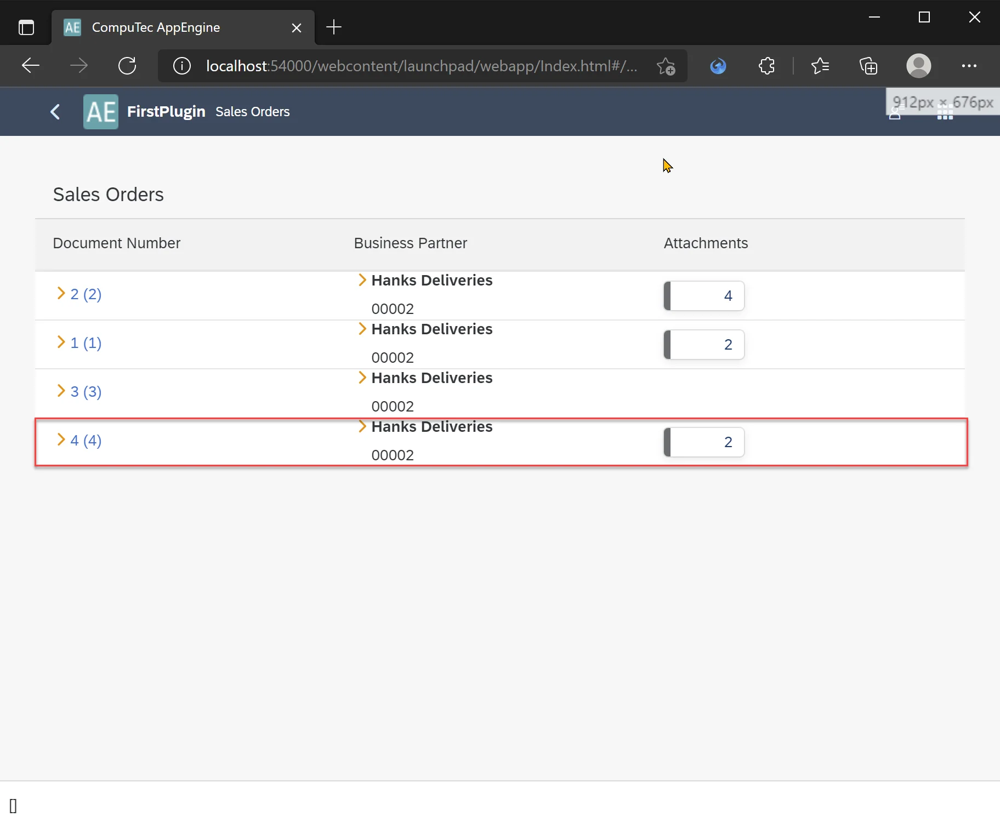
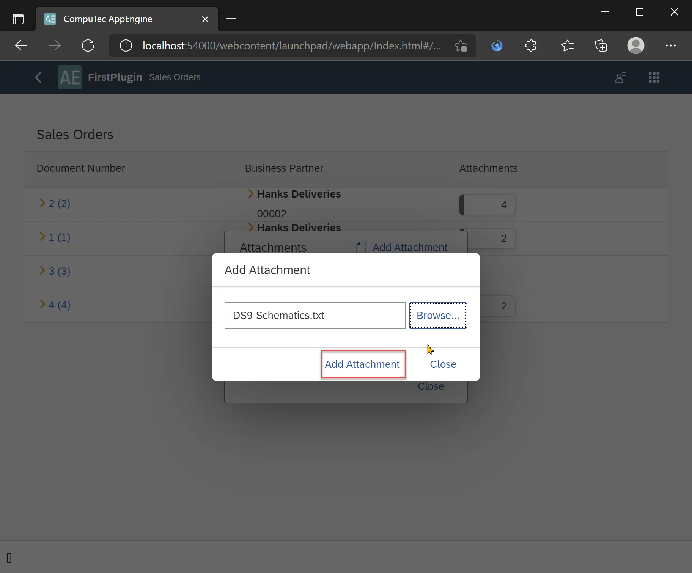

# Custom controller

## Description

In this example, we will show how to add a custom controller. Example in this tutorial base on previous tutorial - Attachments. In this example, we used AppEngine build in Attachments controller to upload Attachment. In this example, we will add a custom controller, and in it, we will add an uploaded attachment to the selected Sales Order.

## Creating custom controller

1. Open your Plugin solution in Visual Studio.

2. Create a new class SalesOrderController.cs inside Controllers/Api.



3. This controller needs to inherit from CompuTec.AppEngine.Base.Infrastructure.Controllers.API.AppEngineSecureController, because we need to authenticate a user to work on SAP document.

SalesOrderController.cs

```
using CompuTec.AppEngine.Base.Infrastructure.Controllers.API;

namespace CompuTec.AppEngine.FirstPlugin.Controllers.Api
{
    public class SalesOrderController : AppEngineSecureController
    {

    }
}
```

4. Now we will add a simple model to pass parameters. First, let's create a new folder in our plugin model project called SalesOrder.

5. Inside add new file SalesOrderAttachment.cs defined as below:



SalesOrderAttachment.cs

```
namespace CompuTec.AppEngine.FirstPlugin.Models.Models.SalesOrder
{
    public class SalesOrderAttachment
    {
        public int DocEntry { get; set; }
        public string FileName { get; set; }
        public string FileExtension { get; set; }

    }
}
```

6. We will need two methods to retrieve Objects from SAP.

- GetSalesOrder – this metod will load SalesOrder.

GetSalesOrder

```
private Documents GetSalesOrder(int DocEntry)
        {
            Documents SalesOrder = Company.GetBusinessObject(BaseLayer.DI.BoObjectTypes.oOrders);
            if (!SalesOrder.GetByKey(DocEntry))
                throw new System.Exception($"Couldn't load Sales Order with DocEntry: {DocEntry}");

            return SalesOrder;
        }
```

- GetAttachment – this method will create new Attachments object and load it from DB if it exists for given Sales Order.

GetAttachment

```
private Attachments2 GetAttachment(int AtcEntry)
        {
            Attachments2 atc = Company.GetBusinessObject(BaseLayer.DI.BoObjectTypes.oAttachments2);
            if (AtcEntry > 0)
            {
                if (!atc.GetByKey(AtcEntry))
                {
                    throw new System.Exception($"Fatal error. Couldn't load Attachment witch AbsoluteEntry: {AtcEntry}");
                }
            }
            return atc;
        }
```

- GetAttachmentsPath – this method will return attachments path base on SAP configuration. We will need this path as the source of our attachment and this is the path where the AppEngine Attachments controller will upload attachments.

GetAttachmentsPath

```
public string GetAttachmentsPath()
        {
            var result = "";

            var qm = new QueryManager();
            qm.CommandText = "select \"AttachPath\" from \"OADP\" ";

            using (var rs = qm.Execute(Session.Token))
            {
                result = rs.Fields.Item("AttachPath").Value.ToString();
            }

            return result;
        }
```

- AddAttachment – this is controller method that will add attachment information to Sales Order

- HttpPost annotation stands for POST method

- the route is defining the path to our method

- As the input parameter, we are using a simple model created earlier – SalesOrderAttachment

AddAttachment

```
[HttpPost]
[Route("AddAttachment")]
public IHttpActionResult AddAttachment([FromBody] SalesOrderAttachment attachment)
{
    Documents so = GetSalesOrder(attachment.DocEntry);
    Attachments2 atc = GetAttachment(so.AttachmentEntry);

    bool firstAttachment = false;

    if (atc.AbsoluteEntry == 0)
        firstAttachment = true;

    string AtcPath = GetAttachmentsPath();

    atc.Lines.SetCurrentLine(atc.Lines.Count - 1);
    if (!string.IsNullOrWhiteSpace(atc.Lines.FileName))
        atc.Lines.Add();
    atc.Lines.SourcePath = AtcPath.TrimEnd('\\');
    atc.Lines.FileName = attachment.FileName;
    atc.Lines.FileExtension = attachment.FileExtension;

    int res;
    if (firstAttachment)
        res = atc.Add();
    else
        res = atc.Update();

    if (res != 0)
        throw new Exception($"Adding attachment failed: {Company.GetLastErrorDescription()}");

    if (firstAttachment)
    {
        so.AttachmentEntry = Int32.Parse(Company.GetNewObjectKey());
        if (so.Update() != 0)
            throw new Exception($"Exception while updating attachment info to Sales Order: {Company.GetLastErrorDescription()}");
    }
    return Ok("");
}
```

- Finally, SalesOrderController.cs should look like this:

SalesOrderController.cs

```
using CompuTec.AppEngine.Base.Infrastructure.Controllers.API;
using CompuTec.AppEngine.Base.Infrastructure.Security;
using CompuTec.AppEngine.FirstPlugin.Models.Models.SalesOrder;
using CompuTec.BaseLayer.DI;
using CompuTec.Core2.DI.Database;
using System;
using System.Web.Http;

namespace CompuTec.AppEngine.FirstPlugin.Controllers.Api
{
    public class SalesOrderController : AppEngineSecureController
    {


        [HttpPost]
        [Route("AddAttachment")]
        public IHttpActionResult AddAttachment([FromBody] SalesOrderAttachment attachment)
        {
            Documents so = GetSalesOrder(attachment.DocEntry);
            Attachments2 atc = GetAttachment(so.AttachmentEntry);

            bool firstAttachment = false;

            if (atc.AbsoluteEntry == 0)
                firstAttachment = true;

            string AtcPath = GetAttachmentsPath();

            atc.Lines.SetCurrentLine(atc.Lines.Count - 1);
            if (!string.IsNullOrWhiteSpace(atc.Lines.FileName))
                atc.Lines.Add();
            atc.Lines.SourcePath = AtcPath.TrimEnd('\\');
            atc.Lines.FileName = attachment.FileName;
            atc.Lines.FileExtension = attachment.FileExtension;

            int res;
            if (firstAttachment)
                res = atc.Add();
            else
                res = atc.Update();

            if (res != 0)
                throw new Exception($"Adding attachment failed: {Company.GetLastErrorDescription()}");

            if (firstAttachment)
            {
                so.AttachmentEntry = Int32.Parse(Company.GetNewObjectKey());
                if (so.Update() != 0)
                    throw new Exception($"Exception while updating attachment info to Sales Order: {Company.GetLastErrorDescription()}");
            }
            return Ok("");
        }


        private Attachments2 GetAttachment(int AtcEntry)
        {
            Attachments2 atc = Company.GetBusinessObject(BaseLayer.DI.BoObjectTypes.oAttachments2);
            if (AtcEntry > 0)
            {
                if (!atc.GetByKey(AtcEntry))
                {
                    throw new System.Exception($"Fatal error. Couldn't load Attachment witch AbsoluteEntry: {AtcEntry}");
                }
            }
            return atc;
        }

        private Documents GetSalesOrder(int DocEntry)
        {
            Documents SalesOrder = Company.GetBusinessObject(BaseLayer.DI.BoObjectTypes.oOrders);
            if (!SalesOrder.GetByKey(DocEntry))
                throw new System.Exception($"Couldn't load Sales Order with DocEntry: {DocEntry}");

            return SalesOrder;
        }

        public string GetAttachmentsPath()
        {
            var result = "";

            var qm = new QueryManager();
            qm.CommandText = "select \"AttachPath\" from \"OADP\" ";

            using (var rs = qm.Execute(Session.Token))
            {
                result = rs.Fields.Item("AttachPath").Value.ToString();
            }

            return result;
        }
    }
}
```

7. Now we should see our method in swagger.


## Using custom controller on frontend

Having our custom controller in place we cannot use it in our UI5 application. After uploading files using the AppEngine Attachments controller we will call the newly created api/FirstPlugin/SalesOrder/AddAttachment method to add an attachment to Sales Order. After that, we will refresh the attachment's information on our dialog and list.

1. First, we will modify our AttachmentsDialog view to include SalesOrder DocEntry and AtcEntry that we will use later. Open SalesOrder.controller.js and change method onAttachmentsButtonPress:

   - DocEntry is retrieved from GenericTag

   - Model for our view is changed to include AtcEntry, DocEntry

   - Attachments array is now in Attachments field.

onAttachmentsButtonPress

```
onAttachmentsButtonPress: async function (oEvent) {
    /** @type {sap.m.GenericTag} */
    const oGenericTag = oEvent.getSource();

    const nAtcEntry = this.getCustomDataForElement(oGenericTag, "AtcEntry");
    const nDocEntry = this.getCustomDataForElement(oGenericTag, "DocEntry");


    const result = await this.getAttachmentsByDocEntry(nAtcEntry);
    const data = {
        Attachmnets: result.value,
        DocEntry: nDocEntry,
        AtcEntry: nAtcEntry
    };
    this.onOpenDialog(data);
},
```

2. Add DocEntry attribute to our GenericTag.

- Open SalesOrder.view.xml and add attribute DocEntry custom data:

```
app:DocEntry="{path: 'AE>DocEntry', type: 'sap.ui.model.odata.type.Int32'}"
```

- Add id attribute to Table and set it to salesOrdersTable. We will need it to refresh data in table later in code.

- Finaly your SalesOrder.view.xml should look like this:

SalesOrder.view.xml

```
<mvc:View
        controllerName="computec.appengine.firstplugin.controller.SalesOrder"
        xmlns:mvc="sap.ui.core.mvc"
        xmlns:ae="computec.appengine.ui.controls"
        xmlns:app="http://schemas.sap.com/sapui5/extension/sap.ui.core.CustomData/1"
        xmlns="sap.m">
    <Table
            id="salesOrdersTable"
            inset="true"
            items="{AE>/CustomViews/Views.Custom(Id='FirstPlugin%3ASalesOrderList')}">
        <headerToolbar>
            <Toolbar>
                <Title text="{i18n>salesOrderTableTitle}"/>
            </Toolbar>
        </headerToolbar>
        <columns>
            <Column>
                <Text text="{i18n>salesOrderDocumentNumberColumnLabel}"/>
            </Column>
            <Column>
                <Text text="{i18n>salesOrderBusinessPartnerColumnLabel}"/>
            </Column>
            <Column>
                <Text text="{i18n>salesOrderAttachmentsColumnLabel}"/>
            </Column>
        </columns>
        <items>
            <ColumnListItem>
                <cells>
                    <ae:Link
                            text="{path: 'AE>DocNum', type: 'sap.ui.model.odata.type.Int32'} ({path: 'AE>DocEntry', type: 'sap.ui.model.odata.type.Int32'})"
                            objectType="fo_Order"
                            objectSubType=""
                            key="{path: 'AE>DocEntry', type: 'sap.ui.model.odata.type.Int32'}"/>
                    <HBox>
                        <ae:Link
                                text=""
                                objectType="fo_BusinessPartner"
                                objectSubType=""
                                key="{path: 'AE>CardCode', type: 'sap.ui.model.odata.type.String'}"/>
                        <ObjectIdentifier
                                title="{path: 'AE>CardName', type: 'sap.ui.model.odata.type.String'}"
                                text="{path: 'AE>CardCode', type: 'sap.ui.model.odata.type.String'}"/>
                    </HBox>
                    <GenericTag
                            app:AtcEntry="{path: 'AE>AtcEntry', type: 'sap.ui.model.odata.type.Int32'}"
                            app:DocEntry="{path: 'AE>DocEntry', type: 'sap.ui.model.odata.type.Int32'}"
                            design="StatusIconHidden"
                            visible="{= %{path: 'AE>NumberOfAttachments', type: 'sap.ui.model.odata.type.Int32'} > 0}"
                            press=".onAttachmentsButtonPress">
                        <ObjectNumber
                                state="Information"
                                emphasized="false"
                                number="{path: 'AE>NumberOfAttachments', type: 'sap.ui.model.odata.type.Int32'}"
                                unit=""/>
                    </GenericTag>
                </cells>
            </ColumnListItem>
        </items>
    </Table>
</mvc:View>
```

3. Because we changed our Attachmnets Dialog model, we need to fix binding in SalesOrderAttachmentsDialog.fragment.xml. We only need to change Table items binding from `"{AT>/}" to "{AT>/Attachmnets}"`.

SalesOrderAttachmentsDialog.fragment.xml

```
<core:FragmentDefinition
        xmlns="sap.m"
        xmlns:core="sap.ui.core"
        xmlns:app="http://schemas.sap.com/sapui5/extension/sap.ui.core.CustomData/1">
    <Dialog title="Attachments">
        <customHeader>
            <OverflowToolbar>
                <Title text="Attachments"/>
                <ToolbarSpacer/>
                <Button
                        icon="sap-icon://add-document"
                        text="Add Attachment"
                        press=".onAttachmentDialogAddAttachment"></Button>
            </OverflowToolbar>
        </customHeader>
        <Table
                growing="true"
                growingThreshold="10"
                inset="false"
                items="{AT>/Attachmnets}"
                fixedLayout="false">
            <columns>
                <Column>
                    <Text text="Attachment Name"/>
                </Column>
                <Column>
                    <Text text="Download"/>
                </Column>
            </columns>
            <items>
                <ColumnListItem>
                    <cells>
                        <Text text="{path: 'AT>FileName'}"/>
                        <Button
                                icon="sap-icon://download"
                                press=".onAttachmentsDialogDownloadInNewTab"
                                app:AbsEntry="{path: 'AT>AbsEntry'}"
                                app:Line="{path: 'AT>Line'}"/>
                    </cells>
                </ColumnListItem>
            </items>
        </Table>
        <endButton>
            <Button
                    text="Close"
                    press=".onAttachmentsDialogCloseFragment"/>
        </endButton>
    </Dialog>
</core:FragmentDefinition>
```

4. Lastly, Add logic to SalesOrder.controller.js

- \_post function will allow as to run REST POST method

\_post

```
_post: function (sData, sUrl) {
    return new Promise((resolve, reject) => {
        Http.request({
            method: 'POST',
            withAuth: true,
            url: sUrl,
            data: sData,
            done: resolve,
            fail: reject
        });
    });
},
```

- \_addAttachmentToSalesOrder – this function adds information about uploaded attachment to the given Sales Order. Here, we need to provide Sales Order DocEntry and uploaded afile name. Inside, prepare parameters model that match SalesOrderAttachment model on backend. Finaly, we call api/FirstPlugin/SalesOrder/AddAttachment POST method and wait for it completition.

\_addAttachmentToSalesOrder

```
_addAttachmentToSalesOrder: async function (nSalesOrderDocEntry, sFileName) {
    const sUrl = `api/FirstPlugin/SalesOrder/AddAttachment`;
    const aNameParts = sFileName.split(".");
    let sExtension = null;
    if (aNameParts.length > 1)
        sExtension = aNameParts.pop();

    const sName = aNameParts.join(".");

    const oParams = {
        "DocEntry": nSalesOrderDocEntry,
        "FileName": sName,
        "FileExtension": sExtension
    };

    try {
        const res = await this._post(JSON.stringify(oParams), sUrl);
        return;
    } catch (error) {
        throw error;
    }
},
```

- \_refreshAttachments – this function refresh attachments in our dialog. Here we need AtcEntry.

\_refreshAttachments

```
_refreshAttachments: async function () {
    const oATModel = this._attachmentsDialog.getModel("AT");
    const nAtcEntry = oATModel.getProperty("/AtcEntry");

    const result = await this.getAttachmentsByDocEntry(nAtcEntry);

    oATModel.setProperty("/Attachmnets", result.value);
    oATModel.refresh();
},
```

- onSalesOrderRefresh – this function simply refresh data in the sales orders table – we need this to update attachments count.

onSalesOrderRefresh

```
onSalesOrderRefresh: function () {
    this.byId('salesOrdersTable').getModel("AE").refresh();
},
```

- Finally, we can call all of our new logic by changing onAddAttachmentSubmit function. We will replace:

old

```
const aAttachments = oATModel.getProperty("/");
aAttachments.push({
    FileName: file.name
});
oATModel.refresh();
```

with

new

```
const DocEntry = oATModel.getProperty("/DocEntry");
await this._addAttachmentToSalesOrder(DocEntry, file.name);
this._refreshAttachments();
this.onSalesOrderRefresh();

```

As you can see we are retrieveing DocEntry from Attachment Dialog model and using it to call \_addAttachmentToSalesOrder. After this is done we run \_refreshAttachments() and onSalesOrderRefresh() to refresh data inside dialog and table.

- SalesOrder.controller.js implementation after changes:

SalesOrder.controller.js

```
sap.ui.define([
    "computec/appengine/core/BaseController",
    "sap/ui/core/Fragment",
    "sap/ui/model/json/JSONModel",
    "computec/appengine/ui/model/http/Http"
],
    /**
     *
     * @param {typeof computec.appengine.core.BaseController} BaseController
     * @param {typeof sap.ui.core.Fragment} Fragment
     * @param {typeof sap.ui.model.json.JSONModel} JSONModel
     * @param {typeof computec.appengine.ui.model.http.Http} Http
     * @returns
     */
    function (BaseController, Fragment, JSONModel, Http) {
        "use strict";

        return BaseController.extend("computec.appengine.firstPlugin.controller.SalesOrder", {
            _attachmentsAddDialog: null,
            onInit: function () {
                BaseController.prototype.onInit.call(this);
                this.setPageName("Sales Orders");
            },
            onAttachmentsButtonPress: async function (oEvent) {
                /** @type {sap.m.GenericTag} */
                const oGenericTag = oEvent.getSource();

                const nAtcEntry = this.getCustomDataForElement(oGenericTag, "AtcEntry");
                const nDocEntry = this.getCustomDataForElement(oGenericTag, "DocEntry");


                const result = await this.getAttachmentsByDocEntry(nAtcEntry);
                const data = {
                    Attachmnets: result.value,
                    DocEntry: nDocEntry,
                    AtcEntry: nAtcEntry
                };
                this.onOpenDialog(data);
            },

            onSalesOrderRefresh: function () {
                this.byId('salesOrdersTable').getModel("AE").refresh();
            },

            onOpenDialog: async function (data) {
                const oView = this.getView();

                if (!this._attachmentsDialog) {
                    this._attachmentsDialog = await Fragment.load({
                        id: oView.getId(),
                        name: "computec.appengine.firstplugin.view.SalesOrderAttachmentsDialog",
                        controller: this
                    });
                    oView.addDependent(this._attachmentsDialog);
                }

                this._attachmentsDialog.setModel(new JSONModel(data), "AT");
                this._attachmentsDialog.open();
            },
            onAttachmentsDialogCloseFragment: function () {
                this._attachmentsDialog.close();
            },
            onAttachmentsDialogDownloadInNewTab: function (oEvent) {
                const oSource = oEvent.getSource();
                const AbsEntry = this.getCustomDataForElement(oSource, "AbsEntry");
                const Line = this.getCustomDataForElement(oSource, "Line");
                const sUrl = `${window.location.origin}/api/Attachments/GetAttachmentByCustomKey/ORDR/DocEntry/${AbsEntry}/null/${Line}`;
                window.open(sUrl, '_blank');
            },


            //#region ADD ATTACHMENTS DIALOG
            onAttachmentDialogAddAttachment: async function (oEvent) {
                await this.onOpenAddAttachmentDialog();
            },
            onOpenAddAttachmentDialog: async function (data) {
                const oView = this.getView();
                if (!this._attachmentsAddDialog) {
                    this._attachmentsAddDialog = await Fragment.load({
                        id: oView.getId(),
                        name: "computec.appengine.firstplugin.view.SalesOrderAttachmentsDialogAdd",
                        controller: this
                    });
                    oView.addDependent(this._attachmentsAddDialog);
                }
                this._attachmentsAddDialog.open();
            },
            onAddAttachmentSubmit: async function () {
                /** @type {sap.ui.unified.FileUploader} */
                const oFileUploader = this.byId("FileUploader");
                let domRef = oFileUploader.getFocusDomRef(),
                    file = domRef.files[0];
                if (!file) {
                    alert("No File Uploaded!");
                    return;
                }
                const fromData = new FormData();
                fromData.append("file", file);
                const sUrl = `${window.location.origin}/api/Attachments/SetAttachment/false/false`;

                try {
                    const response = await fetch(sUrl, {
                        method: 'POST',
                        body: fromData
                    });
                    console.log(response);
                    const oATModel = this._attachmentsDialog.getModel("AT");
                    const DocEntry = oATModel.getProperty("/DocEntry");
                    await this._addAttachmentToSalesOrder(DocEntry, file.name);
                    this._refreshAttachments();
                    this.onSalesOrderRefresh();
                } catch (oError) {
                    console.log(oError);
                } finally {
                    this.onAddAttachmentDialogClose();
                }
            },
            onAddAttachmentDialogClose: function () {
                this._attachmentsAddDialog.close();
            },
            //#endregion

            // #region INTERNAL
            getCustomDataForElement: function (oElement, sCustomDataCode) {
                let oCustomData = oElement.getCustomData().find(x => x.getKey() === sCustomDataCode);
                if (oCustomData)
                    return oCustomData.getValue();
                return null;
            },
            findElementByCustomId: function (oDialog, sCustomId) {
                const oCtr = oDialog.findElements(true).find(
                    el => {
                        let sElId = this.getCustomDataForElement(el, "id");
                        return sElId == sCustomId;
                    }
                );
                return oCtr;
            },
            getAttachmentsByDocEntry: function (sDocNum) {
                const sUrl = encodeURIComponent(`odata/CustomViews/Views.CustomWithParameters(Id='FirstPlugin:Attachments',Parameters=["AbsEntry=${sDocNum}"],paramType=Default.ParamType'Custom')`);
                return this._get(sUrl);
            },

            _refreshAttachments: async function () {
                const oATModel = this._attachmentsDialog.getModel("AT");
                const nAtcEntry = oATModel.getProperty("/AtcEntry");

                const result = await this.getAttachmentsByDocEntry(nAtcEntry);

                oATModel.setProperty("/Attachmnets", result.value);
                oATModel.refresh();
            },

            _addAttachmentToSalesOrder: async function (nSalesOrderDocEntry, sFileName) {
                const sUrl = `api/FirstPlugin/SalesOrder/AddAttachment`;
                const aNameParts = sFileName.split(".");
                let sExtension = null;
                if (aNameParts.length > 1)
                    sExtension = aNameParts.pop();

                const sName = aNameParts.join(".");

                const oParams = {
                    "DocEntry": nSalesOrderDocEntry,
                    "FileName": sName,
                    "FileExtension": sExtension
                };

                try {
                    const res = await this._post(JSON.stringify(oParams), sUrl);
                    return;
                } catch (error) {
                    throw error;
                }
            },

            _get: function (sUrl) {
                return new Promise((resolve, reject) => {
                    Http.request({
                        method: 'GET',
                        withAuth: true,
                        url: sUrl,
                        done: resolve,
                        fail: reject
                    });
                });
            },

            _post: function (sData, sUrl) {
                return new Promise((resolve, reject) => {
                    Http.request({
                        method: 'POST',
                        withAuth: true,
                        url: sUrl,
                        data: sData,
                        done: resolve,
                        fail: reject
                    });
                });
            },

            //#endregion


        });
    });
```

## Results

We will test our solution by adding attachment to Sales Order number 4, which has 2 attachments.



Lets select new Attachmet add cofirm our choice with Add Attachment Button.



Afer uploading attachment and attaching it to Sales Order Add Attachment dialog model and Sales Orders list is refreshed. We can see newly added attachment in Attachments dialog and download it. Also number of attachments seen in background is increased.


Lastly we can check Sales Order document directly in SAP. New attachment is visible in Attachments tab.


