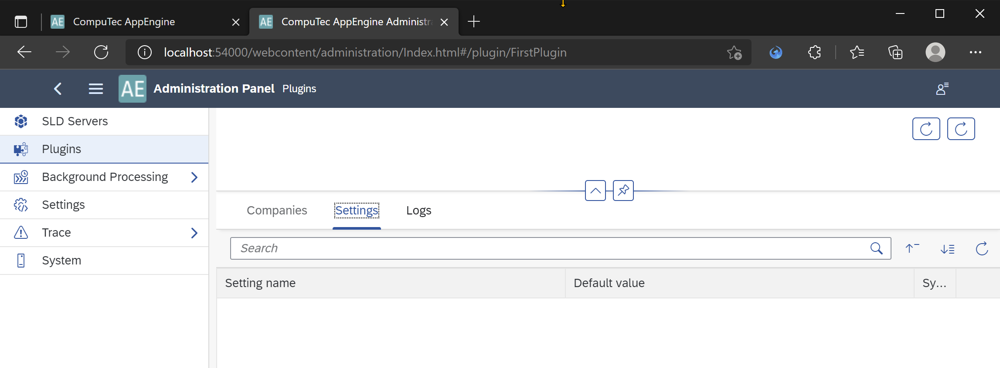
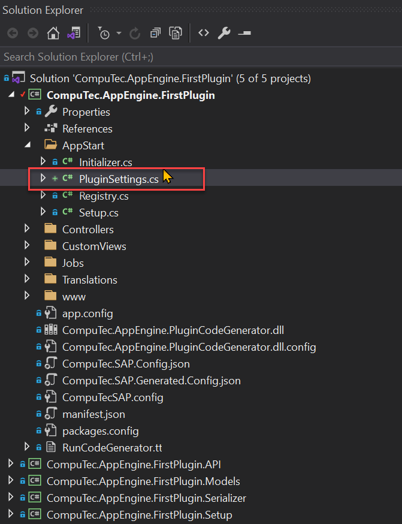

# Plugin configuration

AppEngine allows plugins to expose additional configuration. This configuration can be changed when you navigate to Plugin inside AppEngine Administration Panel. In this tutorial we will add configuration for our FirstPlugin and use it inside SalesOrderToApproveEventJob Job that we created in pervious tutorial. 



## Adding configuration to plugin

1. Create new class PluginSettings.cs that implement abstract class `CompuTec.AppEngine.Base.Infrastructure.Configuration.SettingsCollection<IPluginConfiguration>`



2. You are required to implement GetSettings method - this method should return configuration of out plugin.

PluginSettings.cs

```
using CompuTec.AppEngine.Base.Infrastructure.Configuration;
using CompuTec.AppEngine.Base.Infrastructure.Plugins;
using System;
using System.Collections.Generic;
 
namespace CompuTec.AppEngine.FirstPlugin.AppStart
{
    public class PluginSettings : SettingsCollection<IPluginConfiguration>
    {
        public override List<SettingDefinition> GetSettings()
        {
            throw new NotImplementedException();
        }
    }
}
```

3. Lets add simple configuration that will allow as to choose priority for Task created inside SalesOrderToApproveEventJob Job

- Create new SettingDefinition lists

```List<SettingDefinition> settings = new List<SettingDefinition>();```

- Add new configuration node named SalesOrderToApproveEventJob


```settings.Add(new SettingDefinition<Dictionary<string, object>>("SalesOrderToApproveEventJob", new Dictionary<string, object>(), false, true));```

- 
Add TaskPriority setting inside this node. Notice that to do this you need to set Key as ```<parentName>:<childName>```. Below we are defining also default value for this setting to Medium. You can also see that there is validationFunc declared - PriorityValidation. 

- key– setting name

- defautlValue – setting a default value
  
- validationFunc - function that will be used for validaton

- secure – determines whether you will be able to see your setting in Administration Panel or not

- editable – determines whether you can edit once made setting

```settings.Add(new SettingDefinition<string>($"SalesOrderToApproveEventJob:TaskPriority", ToDoPriority.Medium.ToString(), PriorityValidation, null, false, true));```

- Add validation function - PriorityValidation. Here we are just checking if value exists in ToDoPriority enumerator and if not we are displaying list of possible values.

```
public static void PriorityValidation(string key, string newStatus, IConfiguration configuration)
{
    if (!Enum.TryParse<ToDoPriority>(newStatus, out var a))
    {
        List<string> allowedPriorities = new List<string>();
        foreach(var e in (typeof(ToDoPriority).GetEnumValues())) {
            allowedPriorities.Add(e.ToString());
        }
                 
        throw new AppEngineException($"Incorrect value for Priority: {newStatus}. Allowed values: {string.Join(",", allowedPriorities)}");
    }
             
}
```

4. Finally PluginSettings.cs will have following form

