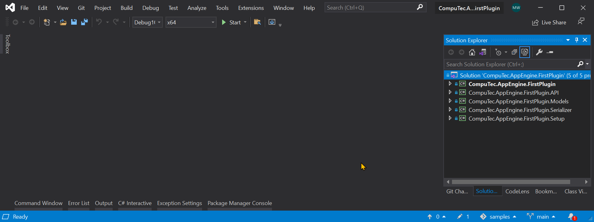
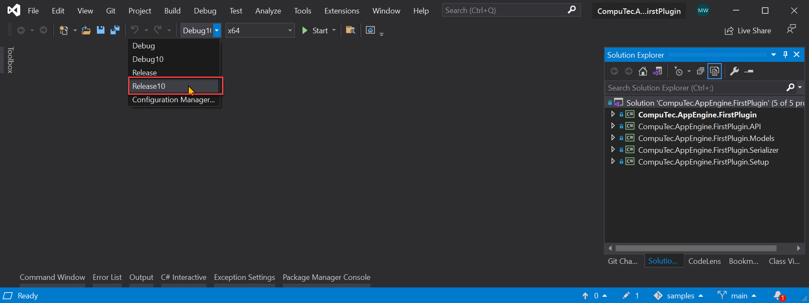
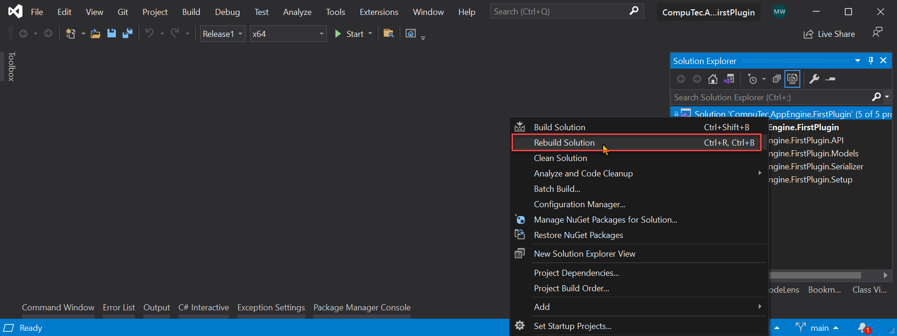
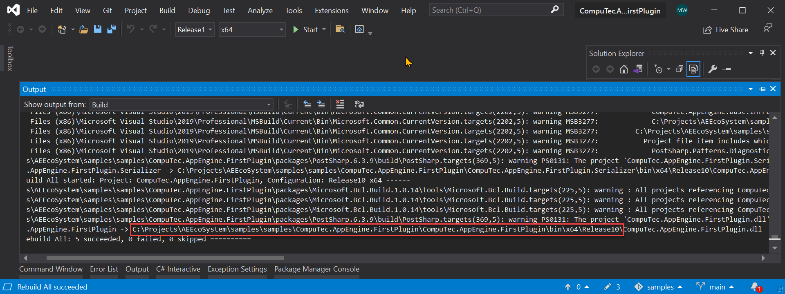
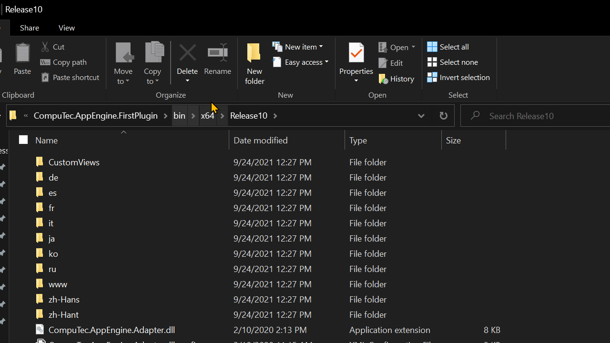
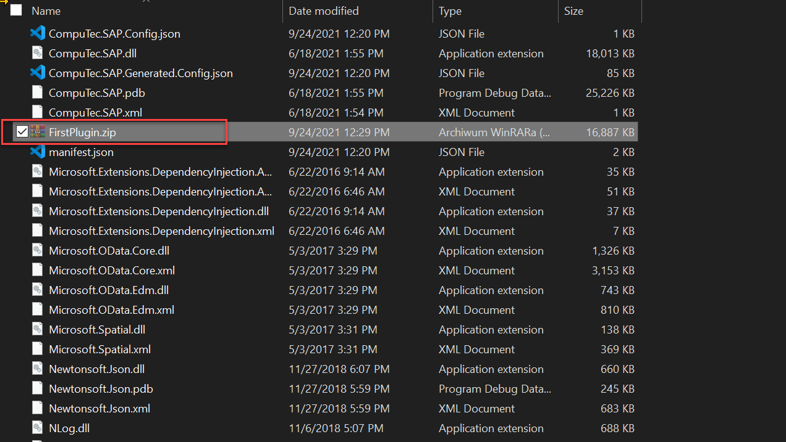

# Plugin Deployment

## Description

Preparing deployment package is straight forward. Release build content should be packed into zip. This zip can be later used to install plugin as described here: Configuration and Administration#Plugins.

### Creating Deployment package

1. Open your solution in Visual Studio.

2. Change configuration to Release or Release10 - this depends of target SAP version. (10 stands for SAP Business One 10 version).

3. Rebuild solution.

4. Now we need to pack build content of Plugin Project. You can find path of your build in build output (or in your project properties - build - output path).

5. Finally we just need to pack content of build into zip archive.

6. Only created zip file is required to install plugin into AppEngine.

