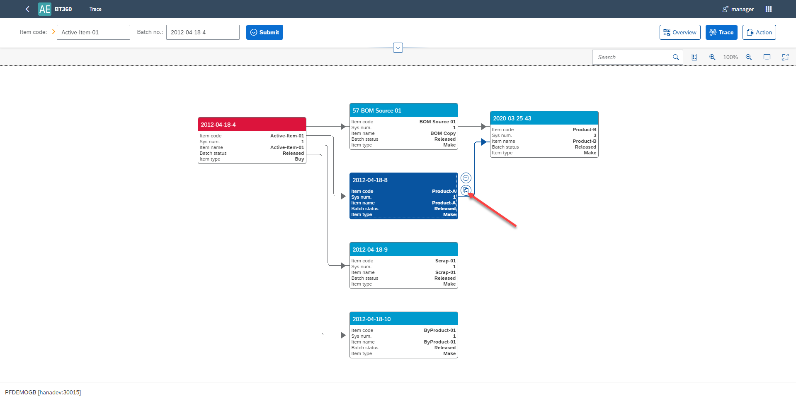
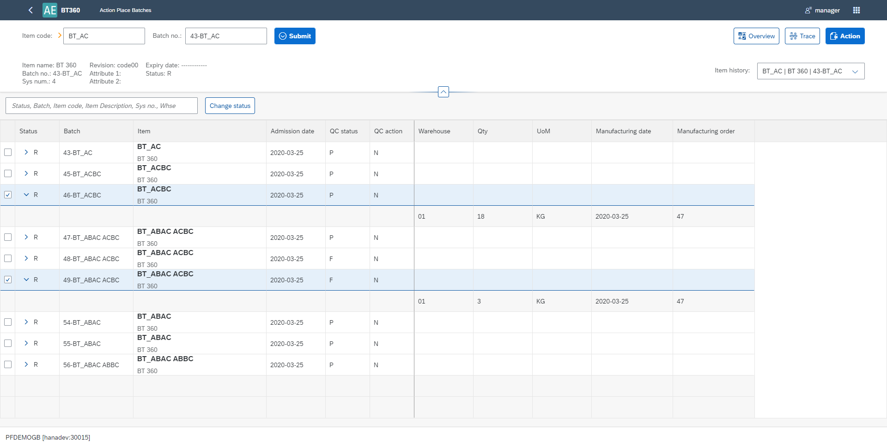

# Overview

Batch Traceability 360 plug-in allows to trace Item Batches through all its life in a company: from production (or purchase), being a part of a production process of other Item, to delivery to a client. Instant access to batches records is very useful, e.g. in complaint management or recall process.

[Batch Traceability Scenario - A Guided Tour](https://youtu.be/ZHUswSIKTu0)

## Installation and Configuration

### Prerequisites

ProcessForce and CompuTec Licence Server is installed and configured. For more information, click [here](/docs/processforce/administrator-guide/licensing/license-server/overview/)

### AppEngine and Plug-in Installation and Configuration

For AppEngine installation please follow this link: [Installation](../../administrators-guide/installation.md)

For Plug-in installation please follow this link: [Configuration and Administration](../../administrators-guide/configuration-and-administration/overview.md).

### ProcessForce

As an option you can call Serialization plug-in from inside the Process Force:

To do this, check the following checkbox:

image

Enter AppEngine url, e.g. `http://{host}:54000`, click Update and restart SAP Business One.

## Start points for function opening

You can reach ProcessForce Batch Traceability 360 by:

- AppEngin launchpad
- Modules Menu (check the path below)

:::info Path
        Inventory > Item Management > Batches > Batch Traceability 360
:::

- Transaction tab on Complaint form:

Click [here](/docs/processforce/user-guide/complaint-management/complaint/) to find out more about Complaint function.

- Batch Master Data form context menu

Click [here](/docs/processforce/user-guide/inventory/batch-control/batch-master-data/overview/) to find out more about Batch Master Data.

## Batch List

You can compose filter using Adapt Filters:

Select a Batch line and you will be redirected to its Overview.

## Overview

On this screen you can find some tiles that bring you analytical information. The Selected Batch is a start point for analysis. Prepared information is related to the Batch and products (Batches) affected by the Batch. That means, information is prepared for all nodes on the right from selected node in the trace graph.

**Note**: If you open Batch Traceability from SAP Business One, you will be able to use yellow arrow functionality as in SAP Business One.

To see extended view of header please select 

Select button  and you will be redirected to Batch Trace graph.

## Batch Trace Graph

On this graph specific Batches are represented by boxes (nodes) with its details. You can zoom in or zoom out the view by using a mouse roll or  and . You can show or hide legend by using . You can expand view by using .

### Going forward and backward

The Batch Trace visualization form shows what a specific Item was made of. It looks back on every Batch that was used in production process to the point of a chosen Batch.

You can also choose a Batch and go forward to see where the Items from a specific Batch were used. To do that, hold Shift and left-click on a desired Batch:

In history list you can find your tracing history.You can switch to another batch from the list at any time in any form: Overview, Trace, Action.

### Transactions

Left-click on a specific box to select it and than select  button to see all activities and transactions connected to the Batch:

Click the yellow arrow in a specific document row to get more information about it.

## Action

To navigate to Action view, please select  button. In Action view you can manage Batches' statuses. To change batch status chose the line in the list and than select checkbox in the first column and finally select button 

