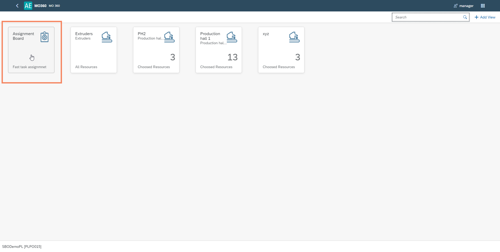
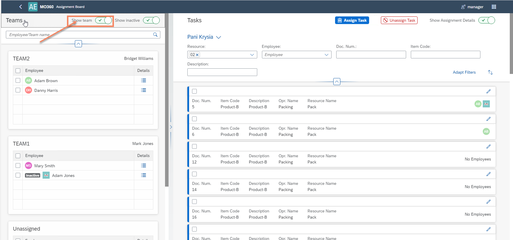
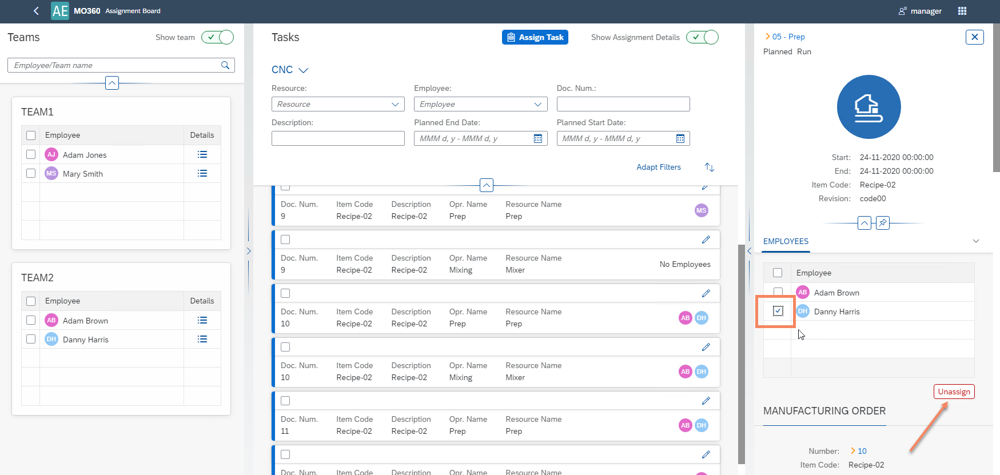
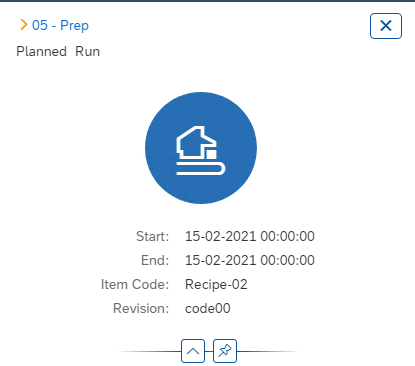
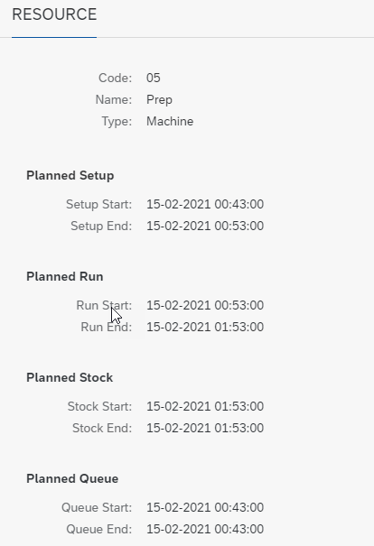

# Assignment Board

Here you can find information on scenario definition.

---

## Assignment board

### Teams

``Production → Time Booking → Team``

Define teams in SAP Business One to be visible on the Assignment Board:

After opening the Assignment Board, the system will show all available Teams:

At the bottom, you can find unassigned employees:

You can also view all Employees (regardless of a Team they are assigned to). All you have to do is unselect 'Show team':

On the view, you can find all employees – active and inactive. If you wish to see only active, you can change the below setting:

### Tasks

#### My views

You can create a filter view template. It may differ depending on a group of employees.

#### Assign a Task to Employees

You can select tasks manually or filter them with preconfigured filters. The list contains Manufacturing Orders that in Released or Started status. Manufacturing Orders are broken down into Operations and Resources. The list shows Machine, Tool and Subcontracting Resources. The list shows the same Tasks that can also be assigned from the CompuTec PDC level.

From the Team panel, you can choose one or more Employees or the entire Team.

Once the Employee/Employees are assigned, they are visible in the taskbar.

The effect of the assigning of a Task is the creation of a CompuTec PDC tile assigned to a specific Employee.

#### Unassigning Task from Employees

Changes to the assigned Task are made in the edit mode. After entering this mode, the side panel on the right side of the screen opens. We can verify the details of the Task as well as unassign from an Employee.

Next, select employees and unassign.

Another method to unassign an employee from the task is to check the employee(s) and then the task(s) and use the button at the top:

### Manufacturing Order details

In this section, you can find the following information about the Manufacturing Order:

- Operation
- Planned Start Date and End Date
- Header Item Code and Revision

#### Manufacturing Order

    - Manufacturing Order details (Number, Item Code, Revision, Planned and Actual Quantity, Required Date)
    

#### Operation

    - Operation details (Code, Name, Sequence, Status)
    

#### Resource

    - Resource details (Code, Name, Type)
    - Time details (start and end time of all time types)
    

#### Additional information

    - Additional information from Resource
    
    
