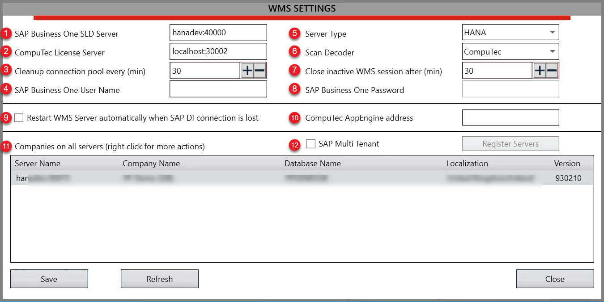
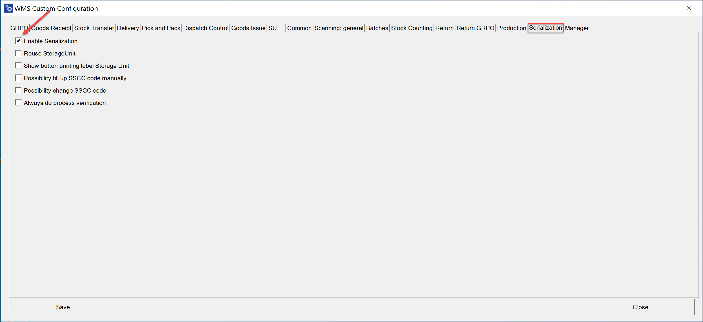
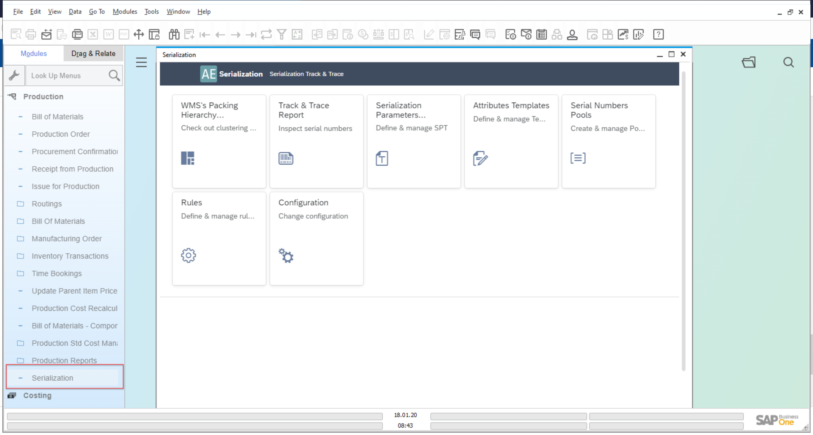

# Serialization Plugin Installation and Configuration

The standard plugin installation and configuration is described in the AppEngine documentation here.

Here you can find information about additional action that you have to take on top of the standard plugin installation be able to fully use the Serialization plugin.
Please remember to install versions of the components according to the version table available here.

---

## Prerquisites

### ProcessForce and CompuTec License Server is installed and configured

For more information click here.

### CompuTec WMS is installed and configured

For installation please follow this link: Installation.

For configuration please follow this link: Custom Configuration.

## AppEngine and serialization plugin installation and configuration

For AppEngine installation please follow this link: Installation.

For plugin installation please follow this link: Configuration and Administration.

Please note: after updating the Serialization plugin and restarting the App Engine, remember to update the schema as per the procedure here.

## Enabling Serialization

### CompuTec WMS

    1. Enter (10) Computec AppEngine address in WMS Server settings:

    

    2. Enable Serialization in Custom Configuration:

    

    3. Remember to customize main menu options to prepare and set menu with Serialization workflow. For this purpose please follow Custom Config Function: Manager and sub-function: Interface Design Manager:

    

### ProcessForce

As an option you can call Serialization plugin from inside the Process Force:

To do this, check the following checkbox:

Enter AppEngine URL, e.g. `http://{host}:54000`, click Update and restart SAP Business One.
